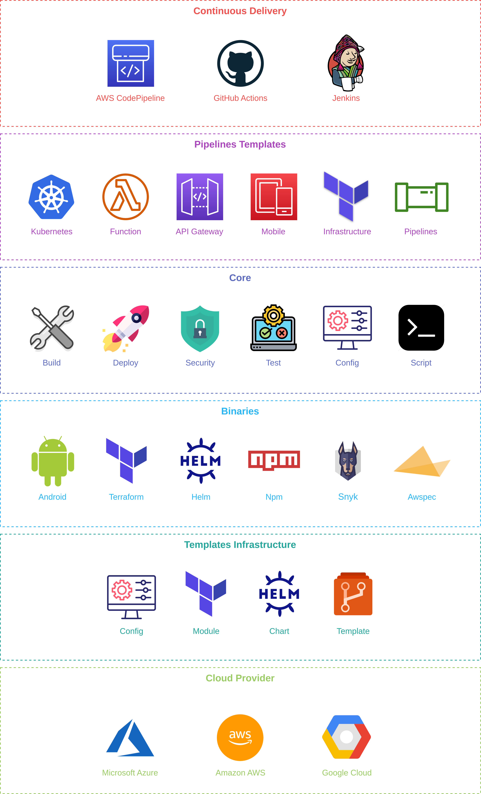

<!--  -->

# Titan - One tool to rule them all

Three rings for the kings Cloud Provider under the sky. Seven for the DevOps Lords in stone palaces. Nine for mortal CICD doomed to die. One for the Dark Lord, upon the dark throne in the Land of Mordor where the Shadows lie. A ring to govern them all. One ring to compile them, one ring to provision them all and bind them in darkness in the Land of Mordor where the shadows lie.

  

<!-- ### Cloud Provider 
## Support
| Name | Sandbox | Incubating | Graduated |
|------|---------|------------|-----------|
| `Amazon AWS` | `Yes` | | |

### CICD

| Name | Sandbox | Incubating | Graduated |
|------|---------|------------|-----------|
| `GitHub Actions` | `Yes` | | |

## Standard

### Repositories

| Project | Type | Service |
|-------|------|---------|
| `titan` | `script` | `core` |
| | `image` | `awspec` |
| | `microservice` | `go` |
| | `demo` | `k8s` |

## Script

### Bash

| Prefix | Type | Service |
|--------|------|---------|
| `function` | `build` | `image` |
| | `test` | `awspec` |
| | `terraform` | `init` |

### Make

| Type | Service |
|------|---------|
| `build` | `image` |
| `test` | `awspec` |
| `terraform` | `init` | -->